### cms_photo_image 構成/関連関係ドキュメント

このドキュメントは、`cms_photo_image` ディレクトリ配下（サブディレクトリ含む）の PHP ファイルについて、主な役割、依存関係（require/include）、定義クラス/関数の概要を整理したものです。

---

## メイン依存関係（図）

```mermaid
graph TD
  subgraph UI/Pages
    SR[search_result.php]
    ID[image_detail.php]
    RE[register_image_edit.php]
    RI[register_image_input.php]
    RC[register_image_confirm.php]
    LI[login.php]
    RL[registration_list.php]
    PL[photo_delete_list.php]
    PDL[photo_deleted_list.php]
    PIL1[pickup_ichiran1.php]
    PIL2[pickup_ichiran2.php]
    WU[web_uploads.php]
    WAM[web_among_uploads.php]
  end

  subgraph Kikan Delivery
    K2[image_search_kikan2.php]
    K3[image_search_kikan3.php]
    K4[image_search_kikan4.php]
    K5[image_search_kikan5.php]
    KMobile[image_search_mobile.php]
  end

  subgraph Core
    CFG[config.php]
    LIB[lib.php]
    KC[kikanConfig.php]
    KCM[kikanCommon.php]
  end

  subgraph Batch/Util
    BIN[make_image_bainari.php]
    CSVP[photo_data_csvSave.php]
    DEL[delete_image_batch.php]
    EXP[exportcsv.php]
    EXPC[exportcsv_cms.php]
    WEBP[convert_all_webp_cron.php]
    CHK[check_missing_thumbs.php]
  end

  SR --> CFG
  SR --> LIB
  ID --> CFG
  ID --> LIB
  RE --> CFG
  RE --> LIB
  RI --> CFG
  RI --> LIB
  RC --> CFG
  RC --> LIB
  RL --> CFG
  RL --> LIB
  PL --> CFG
  PL --> LIB
  PDL --> CFG
  PDL --> LIB
  PIL1 --> CFG
  PIL1 --> LIB
  PIL2 --> CFG
  PIL2 --> LIB
  WU --> CFG
  WU --> LIB
  WAM --> CFG
  WAM --> LIB

  K2 --> KC
  K2 --> KCM
  K3 --> KC
  K3 --> KCM
  K4 --> KC
  K4 --> KCM
  K5 --> KC
  K5 --> KCM
  KMobile --> KC
  KMobile --> KCM

  BIN --> CFG
  BIN --> LIB
  CSVP --> CFG
  CSVP --> LIB
  DEL --> CFG
  DEL --> LIB
  EXP --> CFG
  EXP --> LIB
  EXPC --> CFG
  EXPC --> LIB
  WEBP --> CFG
  WEBP --> LIB
  CHK --> CFG
  CHK --> LIB
```

---

## 概要

- **共通設定**: `config.php`（サイト/DB/メール設定）、`kikanConfig.php`（期間画像系の別設定）
- **共通ライブラリ**: `lib.php`（画像・登録・検索・CSV・各種ユーティリティ/大規模、CMS向け拡張を含む）
- **画像配信（期間）**: `image_search_kikan*.php`（複数世代、モバイル版を含む）
- **検索/詳細/登録 画面**: `search_result.php`, `image_detail.php`, `register_image_input.php`, `register_image_edit.php`, `register_image_confirm.php` ほか
- **CSV/メンテ/WEBP**: `photo_data_csvSave.php`, `exportcsv*.php`, `delete_image_batch.php`, `convert_all_webp_cron.php`, `check_missing_thumbs.php` ほか

---

## 依存関係（require/include）

- 多くの画面系: `config.php`, `lib.php` を `require_once`
- 期間配信系: `kikanConfig.php`, `kikanCommon.php`（または `search_kikan_config.php`）
- バッチ/CSV: `PhpMailer/PHPMailerAutoload.php` を使用するものあり
- `web_among_uploads.php`: `soap_login_image_batch_limi2.php` を `require_once`

---

## 主要ファイルごとの定義（クラス/関数）

### config.php
- 依存: なし
- クラス: なし
- 関数: なし（設定定義のみ）

### kikanConfig.php / kikanCommon.php
- 依存: なし / 一部ユーティリティを内包
- クラス: なし
- 関数: 画像出力ヘルパ/共通処理（`kikanCommon.php`）

### lib.php（中核・大規模）
- 依存: `pdo_mysql`, `gd`, `imagick`（一部）
- クラス:
  - `FileUpload`, `FileUploadBatch`
  - `RegistrationClassifications`
  - `PhotoImageData`, `PhotoImageDB extends PhotoImageData`, `PhotoImageDataAll extends PhotoImageData`
  - `PhotoImageLog`, `PhotoImageNopermit`
  - `ImageSearch`
  - `Album`, `AlbumDetail extends Album`, `AlbumSearch`
  - `CsvFile`, `DispCounter`, `UserManger`, `CmsPhotoDbCore`
- 主な関数（抜粋）:
  - 画像生成/WEBP: `pc_sp()`, `update_photo_filename_th()`, `resize_image()`, `IsAnimatedGif()`, `imagick_gif_thumb()`
  - DB/ユーティリティ: `db_connect()`, `error_exit()`, `array_get_value()`, `dp()`, `is_date()`, `header_out()` など
  - PhotoImage*: データ取得/更新/削除、サムネ生成、キーワード処理、分類名称解決 等

### 期間画像配信（image_search_kikan*.php）
- 依存: `kikanConfig.php`, `kikanCommon.php`
- クラス: 各ファイルに `DispCounter`
- 関数（代表）: `db_connect()`, `mkdirs()`, `changeImageHeightWidth()`, `getNewImageName()`, `getFiveStr()`, `decide_fontsize()`, `write_credit()` ほか（世代により差分）

### 検索・詳細・登録系
- `search_result.php`: 依存 `Pager.php`, `config.php`, `lib.php` / クラスなし / 関数: ページング・描画関数
- `image_detail.php`: 依存 `config.php`, `lib.php` / クラスなし / 関数: 画面内JS多め
- `register_image_input.php`: 依存 `config.php`, `lib.php` / クラスなし / 関数: 入力画面補助
- `register_image_confirm.php`: 依存 `config.php`, `lib.php` / クラスなし / 関数（抜粋）:
  - `disp_image_file_url()`, `disp_photo_name()`, `registration_division()`, `disp_div_classification()`, `disp_classification()`, `disp_direction()`, `disp_country_prefecture()`, `disp_place()`, `check_array_index()`, `disp_category()`
  - `take_picture_time2()`, `take_picture_time()`, `disp_photo_explanation()`, `disp_kikan()`, `disp_kikan2()`, `DBC_SBC()`
  - `disp_range()`, `disp_additional_constraints()`, `disp_monopoly_use()`, `disp_borrowing_ahead()`, `disp_copyright_owner()`
  - `disp_source_image_no()`, `disp_bud_photo_no()`, `disp_customer()`, `disp_registration()`, `disp_photo_no_url()`, `disp_note()`
  - `write_log_tofile()`, `form_reback()`, `delete_record()`, `init()`
- `register_image_edit.php`: 依存 `config.php`, `lib.php` / クラスなし / 関数: 編集・更新ロジックおよび表示補助

### ピックアップ/一覧・その他UI
- `pickup_ichiran1.php`, `pickup_ichiran2.php`: 依存 `Pager.php`（1のみ）, `config.php`, `lib.php` / クラスなし / 関数: ページ移動・スライダ描画 等
- `photo_delete_list.php`, `photo_deleted_list.php`, `registration_list.php`, `findtop4.php` 等: 依存 `Pager.php`（一部）, `config.php`, `lib.php` / クラスなし / 関数: 一覧/描画
- `login.php`: 依存 `config.php`, `lib.php` / クラスなし / 関数: ログイン処理

### WEBアップロード
- `web_uploads.php`: 依存 `config.php`, `lib.php` / クラスなし / 関数: フォーム処理（ファイル保存/CSV読取）
- `web_among_uploads.php`: 依存 `soap_login_image_batch_limi2.php` / クラスなし / 関数: CSVラインの連携呼び出し

### SOAP/バッチ/ユーティリティ
- `soap_login_image_batch_limi2.php`（および `*_webpd.php`, `*_ejpl.php`, `*_ejdi.php`）
  - クラス: `PhotoImageData`, `PhotoImageDB extends PhotoImageData`, `FileUploadBatch`, `RegistrationClassifications`
  - 関数（代表）: `pc_sp()`, `resize_image()`, `array_get_value()`, `db_connect()`, `uploadfiles()` ほか、ID解決/INSERT/キーワード登録 等
- `make_image_bainari.php`: 依存 `config.php`, `lib.php` / クラスなし / 関数: `write_imagetodb()` ほか
- `delete_image_batch.php`: 依存 `config.php`, `lib.php` / クラスなし / 関数: 期限切れ削除、ログ出力
- `photo_data_csvSave.php`, `exportcsv.php`, `exportcsv_cms.php`: CSV出力関数
- `convert_all_webp_cron.php`: 一括WebP生成
- `check_missing_thumbs.php`: サムネイル欠落チェック

### アカウント/管理
- `account_list.php`, `account_new.php`, `account_edit.php`, `account_new_confirm.php`, `account_edit_confirm.php`:
  - 依存 `Pager.php`（一部）, `config.php`, `lib.php` / クラスなし / 関数: 一覧/登録/更新/確認

### ダウンロード/その他
- `downloadutil.php`: ダウンロード出力ユーティリティ
- `upload.php`: 個別アップロード（`photoimg.is_sp/is_pc`等更新）
- `uploadexcel.php`, `liucongxu.php`: `PHPExcel-1.8` を用いたExcel処理（外部ライブラリ）
- `openai/openai.php`: 補助スクリプト（疎結合）

---

## ファイル別・索引（簡易）

- 依存/クラス/関数の網羅は上記各節に集約。関数が膨大なファイル（特に `lib.php`, `soap_login_image_batch_*` 系, `image_search_kikan*` 系）は、用途別グループ化で列挙しました。
- 外部ライブラリ配下（`PHPExcel-1.8` など）は、本体とは疎結合のため詳細列挙を省略しています（必要時に原典を参照）。
- バックアップ/テストファイル（`*_bak_*`, `*_test*`, `*_bk*` 等）は重複となるため割愛しています。

必要であれば、特定のファイル群に対して「全関数名の完全列挙」を追加出力できます（例: `lib.php` のみ、`soap_login_image_batch_limi2.php` のみ等）。

---

## lib.php 全関数一覧（cms_photo_image/lib.php）

以下は`grep`抽出ベースの全関数名一覧です（重複/オーバーロード風は定義順に表記）。用途別の詳細はソース参照。

- 画像/WEBP/サムネ生成系
  - `pc_sp`, `update_photo_filename_th`, `resize_image`, `IsAnimatedGif`, `imagick_gif_thumb`, `write_credit`, `write_credit2`, `make_thumbfile`, `decide_fontsize`
- DB/ユーティリティ基礎
  - `db_connect`, `error_exit`, `array_get_value`, `dp`, `mail_checkk`, `santen_reader`, `is_date`, `conv_htmlstr`, `header_out`, `findNum`
- FileUpload 系（複数コンストラクタ/メソッド）
  - `__construct($fl,...)`, `upload`, `set_upload_info`, `set_write_ok`, `delete_upfile`, `convertToWebp`（別系統で使用）
- PhotoImageData / PhotoImageDB 系（CRUD/補助）
  - `__construct()`, `init_data`, `set_data`, `get_data`, `get_id`, `get_name`, `set_photo_id`, `set_id`, `select_data`, `insert_data`, `delete_data`
  - `check_adjust_param`, `get_keyword_str`, `delete_keyword`, `select_expired_data`, `get_dfrom`, `get_dto`, `write_imagetodb`, `update_data`, `batch_update_data`, `update_data_batch`, `update_photo`, `update_keyword`
  - 名称解決: `get_direction_name`, `get_country_prefecture_name`, `get_country_prefecture_name2`, `get_place_name`, `get_take_picture_time2_name`, `get_take_picture_time_name`, `get_registration_person`
  - キーワード: `insert_keyword`
  - 個別取得: `get_photo_mno`, `get_nopermit_log`, `get_dfrom_date_forhidden`, `get_photo_ext`, `get_photo_server_flag`, `get_photo_filename`, `get_photo_lastid`
  - 採番: `getmaxno`, `setmaxno`
  - マスタ取得: `get_publishing_situation`, `get_nopermis_reasons`, `get_category`, `get_registration_division`, `get_registration_division2`, `get_classification`, `get_direction`, `get_country_prefecture`, `get_place`, `get_keyword`, `get_take_picture_time`, `get_take_picture_time2`, `get_borrowing_ahead`, `get_range_of_use`
- PhotoImageDataAll / ImageSearch / Album 系
  - `PhotoImageDataAll`（旧式コンストラクタ名）, `init_data`, `set_data`（複数バリアント）
  - `ImageSearch`: `__construct`, `init_condition`, setter群（ext/各検索条件）
    - 検索: `select_image_keyword`, `select_image_all`, `select_image`, `select_image_fmid_2`, `select_image_fmid`, `select_image_csv`, `select_image_registed`, `select_image_deleted`, `select_image_nopermit`
  - `Album`: 各種取得・更新・明細操作（該当関数が多数）
- その他
  - `DispCounter`クラス（期間配信で流用）、`UserManger`、`CmsPhotoDbCore`（補助ロジック）

（関数は上記小分類に整理。正確な引数/戻り値はソースを参照してください）

---

## SOAP バリアント差分（soap_login_image_batch_*）

目的が同じ複数ファイルのため、定義関数の差分を要約します（共通関数は割愛）。

- 共通で定義される主な関数
  - `array_get_value`, `Chk_num`, `db_connect`, `uploadfiles`, `getCountryPrefectureName`, `check_Photomon`, `uploadfile`, `set_insertdata`, `get_id`, `get_id2`, `select_user`, `trimspace`
  - クラス群: `PhotoImageData`, `PhotoImageDB extends PhotoImageData`, `FileUploadBatch`, `RegistrationClassifications`
  - `getmaxno`, `setmaxno`, `insert_data`（DB登録系）
  - 分類/名称取得: `get_direction_name`, `get_country_prefecture_name`, `get_place_name`, `get_take_picture_time*` など
  - 画像処理: `write_credit`, `upload`, `decide_fontsize`, `make_thumbfile`, `write_credit2`

- limi2 系（`soap_login_image_batch_limi2.php`）
  - 追加: `pc_sp`, `update_photo_filename_th`, `resize_image`
  - `convertToWebp` を含む（WEBP変換内蔵）
  - コンストラクタ名は`__construct`（新しめの記法）

- limi 系（`soap_login_image_batch_limi.php`）
  - `pc_sp`, `resize_image`あり（`update_photo_filename_th`は limi2 と記法/実装差）
  - `__construct` 記法採用

- webpd 系（`soap_login_image_batch_webpd.php`）
  - 古いPHPのコンストラクタ記法（クラス名と同名）: `PhotoImageData()`, `PhotoImageDB()`, `FileUploadBatch()`, `RegistrationClassifications()`
  - `convertToWebp` の定義は limi2 側に比べ簡素/別構造

- ejpl / ejdi 系（`soap_login_image_batch_ejpl.php`, `soap_login_image_batch_ejdi.php`）
  - 関数構成・名称は webpd と類似（古いコンストラクタ表記）
  - `getCountryPrefectureName`やID解決ロジックは limi 系と同系統

- 差分まとめ
  - コンストラクタ記法の違い（`__construct` vs クラス名関数）
  - 画像処理系の実装差（`update_photo_filename_th` の有無、`convertToWebp` の実装有無/差分）
  - 変数名/引数の軽微な差（機能は概ね同じ）

必要であれば、各ファイルの関数シグネチャを機械抽出してCSV/Markdown表に出力することも可能です。
