### photo_db 構成/関連関係ドキュメント

このドキュメントは、`photo_db` ディレクトリ配下（サブディレクトリ含む）の PHP ファイルについて、主な役割、依存関係（require/include）、定義クラス/関数の概要を整理したものです。

---

## メイン依存関係（図）

```mermaid
graph TD
  subgraph UI/Pages
    SR[search_result.php]
    ID[image_detail.php]
    RE[register_image_edit.php]
    WU[web_uploads.php]
  end

  subgraph Kikan Delivery
    K4[image_search_kikan4.php]
    K5[image_search_kikan5.php]
  end

  subgraph Core
    CFG[config.php]
    LIB[lib.php]
    KC[kikanConfig.php]
    KCM[kikanCommon.php]
  end

  subgraph Mall Integration
    TASK[malltools/Task.php]
    MIB[malltools/mall_image_batch.php]
    IMG[malltools/Img.php]
    S3[malltools/service/S3/S3.php]
    CPI[malltools/CommonPhotoImage.php]
  end

  subgraph Batch
    BIN[make_image_bainari.php]
    CSV[batch/photo/photo_data_csvSave.php]
    DEL[batch/photo/delete_image_photodb.php]
  end

  SR --> CFG
  SR --> LIB
  ID --> CFG
  ID --> LIB
  RE --> CFG
  RE --> LIB
  WU --> CFG
  WU --> LIB

  K4 --> KCM
  K4 --> KC
  K5 --> KCM
  K5 --> KC

  TASK --> S3
  TASK --> MIB
  TASK --> CFG
  TASK --> LIB
  MIB --> CPI
  MIB --> LIB
  MIB --> CFG

  BIN --> CFG
  BIN --> LIB
  CSV --> CFG
  CSV --> LIB
  DEL --> CFG
  DEL --> LIB
```

---

## 概要

- **共通設定**: `config.php`（サイト/DB設定）、`kikanConfig.php`（期間画像系の別設定）
- **共通ライブラリ**: `lib.php`（画像・登録・検索・CSV・各種ユーティリティ/大規模）
- **画像配信（期間）**: `image_search_kikan4.php` / `image_search_kikan5.php`（サムネイル生成・WebP対応など）
- **検索/詳細/編集 画面**: `search_result.php`, `image_detail.php`, `register_image_edit.php`
- **画像バイナリ化/メンテ**: `make_image_bainari.php`, `batch/photo/*`（CSV出力・期限切れ削除）
- **MALL連携**: `malltools/*`（S3 経由の画像/CSV 連携バッチ）
- **バッチ/外部ライブラリ**: `batch/lf/*`（Twig ほかのサードパーティ/テスト類が多数）

---

## 依存関係（require/include）

- `search_result.php` → `Pager.php`, `config.php`, `lib.php`
- `image_detail.php` → `config.php`, `lib.php`
- `register_image_edit.php` → `config.php`, `lib.php`
- `make_image_bainari.php` → `config.php`, `lib.php`
- `web_uploads.php` → `config.php`, `lib.php`
- `web_among_uploads.php` → `soap_login_image_batch_limi2.php`
- `image_search_kikan4.php` → `kikanCommon.php`, `kikanConfig.php`
- `image_search_kikan5.php` → `kikanCommon.php`, `kikanConfig.php`
- `malltools/Task.php` → `../config.php`, `../lib.php`, `malltools/mall_image_batch.php`, `malltools/Config.php`, `malltools/Img.php`, `malltools/Log.php`, `malltools/service/TaskService.php`, `malltools/service/S3/S3.php`, `malltools/TaskResult.php` ほか
- `batch/photo/photo_data_csvSave.php` → `PhpMailer/PHPMailerAutoload.php`
- `batch/photo/delete_image_photodb.php` → `PhpMailer/PHPMailerAutoload.php`

---

## 主要ファイルごとの定義（クラス/関数）

### config.php
- 役割: サイト/DB/アップロード/サムネイル等の設定、定数 `REGPHOTOMNO`。
- グローバル変数: `$db_host`, `$db_user`, `$db_password`, `$db_name`, `$db_charset`, `$upload_conf`, `$thumb_dir`, `$thumb_width`, `$write_credit`, `$font_name`, `$credit_fontsize` など。

### kikanConfig.php
- 役割: 期間画像系の DB 設定とルートディレクトリ設定。
- 変数: `$kikan_root_dir_photo_db`, `$kikan_root_dir_cms_photo_image` ほか。

### lib.php（大規模・中核）
- 役割: DB接続、バリデーション/HTMLユーティリティ、画像アップロード/サムネイル、クレジット描画、写真データモデル、検索、アルバム、CSV など多岐。
- 代表的な関数（抜粋）:
  - `db_connect()`, `error_exit()`, `array_get_value()`, `dp()`, `mail_checkk()`, `is_date()`, `header_out()` などの共通関数
  - 画像関連: `write_credit*()`, `decide_fontsize()`, `convertToWebp()` ほか
- 代表クラス:
  - `FileUpload`（アップロード/サムネイル生成/クレジット描画）
  - `FileUploadBatch`, `FileUploadBatchMall`
  - `RegistrationClassifications`
  - `PhotoImageData`, `PhotoImageDB extends PhotoImageData`, `PhotoImageDataAll extends PhotoImageData`
  - `PhotoImageLog`, `PhotoImageNopermit`
  - `ImageSearch`（検索/一覧取得など）
  - `Album`, `AlbumDetail extends Album`, `AlbumSearch`
  - `CsvFile`
  - `DispCounter`
  - `UserManger`

### search_result.php
- 役割: 画像検索結果画面ロジック/出力。
- 主な関数（PHP）:
  - `getSearchCount()`, `dispSelectValue()`, `ShowPagesList()`, `ShowPageHeaderFooter()`, `setSearchCondition()`, `dateDiff()`, `disp_img()` ほか

### image_detail.php
- 役割: 画像詳細画面（サーバサイドで `ImageSearch` を用いて対象画像取得）。
- 備考: 多数の JavaScript 関数（UI操作）を同ファイル内に含む。

### register_image_edit.php
- 役割: 登録済画像の編集/更新/削除画面。
- 主な関数（抜粋）: `check_Photomon()`, `check_photo_mno()`, `get_photo()`, `set_updatedata()` ほか、分類/方面/国・都道府県/地名などの表示生成関数多数。

### image_search_kikan4.php
- 役割: 期間画像の配信（指定サイズ生成・キャッシュ・JPG/PNG/GIF対応）。
- 主な関数: `db_connect()`, `mkdirs()`, `changeImageHeightWidth()`, `getNewImageName()`, `getFiveStr()`, `fileExitOrNo()`
- クラス: `DispCounter`（表示回数集計: `isExitsCheck()`, `select_data1()`, `select_data2()`, `insert_data()` 等）

### image_search_kikan5.php
- 役割: kikan4 の拡張版。WebP 対応、クレジット描画、サイズ決定ロジック強化。
- 主な関数（抜粋）: `getKikan4Image()`, `db_connect()`, `mkdirs()`, `changeImageHeightWidth()`, `decide_fontsize()`, `write_credit()`, `getNewImageName()`, `getFiveStr()`, `fileExitOrNo()`
- クラス: `DispCounter`

### make_image_bainari.php
- 役割: 公開中画像（publishing_situation_id=2）を走査し、`photo_imgdata(image1/2/3)` にバイナリ格納。
- 主な関数: `write_imagetodb()`, `write_log_tofile()`

### soap_login_image_batch_limi2.php（大規模）
- 役割: SOAP/CSV ベースのバッチ登録（歴史的スクリプト）。画像縮小/生成、DB登録、各種マスタ解決等。
- 代表的な関数（抜粋）: `pc_sp()`, `resize_image()`, `array_get_value()`, `Chk_num()`, `db_connect()`, `uploadfiles()` ほか
- 定義クラス（抜粋）: `PhotoImageData`, `PhotoImageDB extends PhotoImageData`, `FileUploadBatch`, `RegistrationClassifications`

### web_uploads.php / web_among_uploads.php
- 役割: ブラウザから CSV と複数画像をアップロードし、`web_among_uploads.php` 経由でバッチ登録（`soap_login_image_batch_limi2.php` を require）。
- 備考: 画面内の JS で CSV 抜粋→API 送信（`csvcontentList`）。

### malltools（MALL 連携）
- 代表エントリ: `Task.php`
  - 役割: S3 上の処理対象ディレクトリ検出→ダウンロード→CSV 読み込み→画像クロップ（`Img`）→DB 反映（`mall_image_batch.php` の関数を呼び出し）→`processed/`へ移動。
  - 主要メソッド: `__construct()`, `run($argv)`, `downLoadFile()`, `process_add()`, `process_update()`, `fileValidate()`
  - 依存/呼出先:
    - `service/S3/S3.php`（`S3Client`ラッパー）
    - `mall_image_batch.php`（下記の関数群）
    - `service/TaskService.php`（エラー通知メール）
    - `TaskResult.php`（処理結果集計）
    - `Config.php`（INI設定読込）
- `malltools/mall_image_batch.php`
  - 関数: `insertPhotoImage($csv)`, `updatePhotoImage($csv)`, `deleteImage($csv)`, `updatePhotoImageThumbAll($mall_no)` ほか
  - 補助関数: `funcGetMallNo()`, `checkCsvData()`, `set_insert_data()`, `set_update_data()`
  - 画像/分類名解決: `CommonPhotoImage`（後述）
- `malltools/CommonPhotoImage.php`
  - クラス: `CommonPhotoImage`
  - 主要メソッド: `getPhotoByMallNo()`, `getPhotoByBudPhotoNo()`, `checkPhotoMno()`, `getCategoryNames()`, `getClassificationNames()`, `get_id()`, `get_id2()`, `getTakePictureTime()`, `getCategories()` ほか
  - 削除: `deletePhotoImage()`（MALL番号ベース削除実装あり）
- `malltools/Img.php`
  - クラス: `Img`（Imagickベースのクロップ/白ベタ/ICCプロファイル適用/保存）
- `malltools/service/S3/S3.php`
  - クラス: `S3`（`getBucketPaths()`, `moveObject()`, `restoreObject()`, `downloadAll()` ほか）
- `malltools/service/TaskService.php`
  - クラス: `TaskService`（`sendMail()`, 失敗時の本文生成）
- `malltools/TaskResult.php`
  - クラス: `TaskResult`（シングルトン、`setErrorMsg()`、行番号収集など）
- `malltools/Config.php`
  - クラス: `Config`（INI 読込/保存、セクション単位アクセス）

### その他の主要PHP（補足）
- `image_search_kikan2.php`, `image_search_kikan3.php`
  - いずれも `kikanCommon.php` を `require_once`。`image_search_kikan4/5.php`と同系の期間画像配信系。
- `mall_revice_api.php`
  - `config.php`, `lib.php` を `require_once`。MALL連携の補助API。
- `image_search_kikan_old.php`
  - 旧版の配信＋ファイル管理ユーティリティ（Zip/Tar操作クラス等を内包）。

---

## 第三者ライブラリ/サブツリー

- `batch/lf/*` 以下に Twig 関連（`lib/plugin/twig`）やテストコードが多数含まれます（アプリ本体とは直接の結合は薄い）。
- `malltools/vendor/*`（AWS SDK, Guzzle, PSR 等）: `S3.php` から `Aws\\S3\\S3Client` を利用。

---

## 代表的なデータモデル/処理フローの関係

- 画面系（`search_result.php`, `image_detail.php`, `register_image_edit.php`）は、共通の `lib.php` 内クラス（`ImageSearch`, `PhotoImageDB` 等）と `config.php` 設定に依存。
- 期間画像配信（`image_search_kikan4.php/5.php`）は、設定（`kikanConfig.php`）と、GDベース処理/クレジット描画ユーティリティを使用。`DispCounter` により表示回数を蓄積可能（更新処理はコメントアウト箇所あり）。
- バッチ系（`malltools/Task.php`）は、S3 連携→ローカル保存→画像加工（`Img`）→DB 登録（`mall_image_batch.php` の `insert/update/delete`）→S3 側フォルダ移動。
- CSV/メンテ（`batch/photo/*`）は、公開中画像の CSV 出力・期限切れ削除などを行い、PHPMailer により結果通知。

---

## 備考

- ファイルパス/URL からローカル実体を導出して WebP を作成/参照するロジックが複数ファイル（特に `image_search_kikan5.php`）に存在します。
- `image_detail.php` や `web_uploads.php` は、PHP と同一ファイル内に多数の JavaScript 関数を含みます（UI 操作用）。
- `soap_login_image_batch_limi2.php` と `lib.php` には似通ったクラス/関数が重複定義されている箇所があり、運用歴史に伴うバリエーションが混在しています。

---

## 参照のコツ

- モデル/DB まわり: `lib.php` の `PhotoImage*` 系、`ImageSearch`
- 画像加工: `malltools/Img.php`（Imagick）、`image_search_kikan*.php`（GD + クレジット描画）
- S3 連携: `malltools/service/S3/S3.php`
- バッチエントリ: `malltools/Task.php` と `malltools/mall_image_batch.php`
